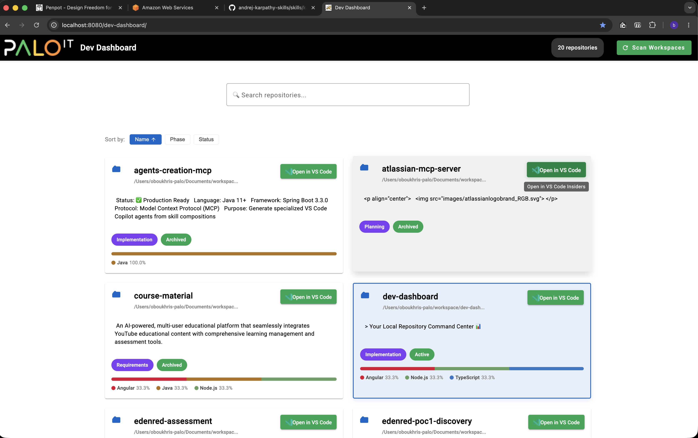

# 🚀 Dev-Dashboard

> **Your Local Repository Command Center** 📊

<div align="center">


*A beautiful desktop app for managing all your git repositories in one place* ✨

</div>

---

## 🎯 What is Dev-Dashboard?

Dev-Dashboard is a lightweight, local-first **desktop application** that helps developers **organize, search, and manage** all their git repositories from a single, intuitive interface.

### ✨ Key Features

- 🔍 **Smart Search** - Find repositories instantly by name, path, tech stack, or keywords
- 📦 **Auto-Discovery** - Automatically scans your workspace directories for git repos
- 🏷️ **Metadata Management** - Add descriptions, phases, and statuses to your projects
- 🎨 **Tech Stack Detection** - Automatically identifies Node.js, Angular, Java, .NET, Python, TypeScript
- 📝 **Inline Editing** - Double-click to edit descriptions on the fly
- 🚀 **VS Code Integration** - Open any repository in VS Code Insiders with one click
- 💾 **Local Storage** - All your customizations saved locally (no cloud required)
- 🎭 **Material Design** - Beautiful, responsive UI with Palo IT branding
- 🎯 **Setup Wizard** - First-run configuration wizard for easy workspace setup
- 🟢 **Visual Branding** - Green scan button aligned with Palo IT brand colors (#00A651)

---

## 🖼️ Screenshot

<div align="center">
  
  
  *Your Local Repository Command Center - Beautiful card-based interface with search, filtering, and one-click VS Code integration*
</div>

---

## 🚀 Quick Start for New Developers

### 1️⃣ Clone & Install

```bash
git clone <repository-url>
cd dev-dashboard
npm install  # Installs all dependencies (frontend + backend)
```

### 2️⃣ Configure Your Workspace Paths

⚠️ **Important:** Configure which directories contain your git repositories.

**Option A: Interactive Setup (macOS/Linux - Recommended)**

```bash
cd src/backend
./setup.sh
```

**Option B: Manual Setup (All Platforms)**

```bash
cd src/backend
cp .env.example .env
# Edit .env and update WORKSPACE_PATHS
# Example: WORKSPACE_PATHS=/Users/johndoe/workspace,/Users/johndoe/projects
```

### 3️⃣ Build & Launch

```bash
npm run build:prod  # Build production bundle
npm start           # Launch desktop app
```

🎉 **That's it!** The desktop app opens automatically with your repositories.

---

## 💻 Development Mode

```bash
npm run dev  # Hot-reload development mode
```

---

## 📚 Full Documentation

- 📖 **[SETUP.md](SETUP.md)** - Complete setup, build, deployment, and troubleshooting guide
- ⚙️ **Configuration** - See [SETUP.md#configuration](SETUP.md#-configuration)
- 🐛 **Troubleshooting** - See [SETUP.md#troubleshooting](SETUP.md#-troubleshooting)
- 🏭 **Production Deployment** - See [SETUP.md#production-deployment](SETUP.md#-production-deployment)

---

## 🎨 Tech Stack

### Frontend
- ⚡ **Angular 18** - Modern component-based framework
- 🎨 **Material Design** - Beautiful, accessible UI components
- 🔄 **Elf** - Lightweight RxJS state management
- 🎯 **TypeScript** - Type-safe development

### Backend
- 🟢 **Node.js + Express** - Fast, lightweight API server
- 📁 **Filesystem API** - Direct access to your local repositories
- 🔍 **Repository Scanner** - Automatic git detection and metadata extraction
- 📖 **README Parser** - Extracts descriptions from README files

### Desktop App
- ⚡ **Electron** - Native desktop application
- 🖥️ **Single Executable** - No web servers, no terminals, just run the app
- 💾 **localStorage** - Client-side persistence
- 🚫 **No Authentication** - Local use only (no security required)

---

## 📚 Documentation

This project follows a structured Product Development Lifecycle (PDLC) approach:

- 📋 **[Requirements](docs/01-requirements/)** - User stories, personas, business case
- 🏛️ **[Architecture](docs/02-architecture/)** - System design, tech specs, design system
- 🧪 **[Testing](docs/03-testing/)** - Test strategies, BDD scenarios
- 📅 **[Planning](docs/04-planning/)** - Sprint planning, deployment strategy
- 💻 **[Implementation](docs/05-implementation/)** - Current sprint, story tracking

---

## 🛠️ Development

### Project Structure

```
dev-dashboard/
├── electron/             # Electron main process
├── src/
│   ├── backend/         # Node.js API (filesystem operations)
│   └── frontend/        # Angular UI
├── docs/                # PDLC documentation
└── release/             # Built installers (.dmg, .exe, .AppImage)
```

### Key Commands

```bash
# Desktop App
npm start               # Launch Electron app
npm run dev             # Development mode (hot-reload)
npm run build:prod      # Build production bundle
npm run package         # Package for distribution

# Testing
npm test                # Run all tests
npm run test:frontend   # Frontend tests only
npm run test:backend    # Backend tests only
```

---

## 🤝 Contributing

This is an internal tool for Palo IT developers. If you'd like to contribute:

1. 🍴 Fork the repository
2. 🌿 Create a feature branch (`git checkout -b feature/amazing-feature`)
3. 💬 Commit your changes (`git commit -m 'Add amazing feature'`)
4. 📤 Push to the branch (`git push origin feature/amazing-feature`)
5. 🎉 Open a Pull Request

---

## 📖 Additional Resources

- 🔧 **[SETUP.md](SETUP.md)** - Detailed setup, build, and deployment instructions
- 📋 **[Requirements](docs/01-requirements/user-stories.md)** - Complete list of user stories
- 🏛️ **[Architecture Design](docs/02-architecture/architecture-design.md)** - System architecture
- 🎨 **[Design System](docs/02-architecture/design-systems.md)** - Palo IT branding guidelines

---

## 📝 License

This project is for internal use at Palo IT.

---

## 🙏 Acknowledgments

- Built with ❤️ by the Palo IT development team
- Design inspired by Material Design principles
- Powered by the amazing Angular and Node.js ecosystems

---

<div align="center">

**Happy Coding! 🚀**

*Made with 💙 at Palo IT*

</div>
