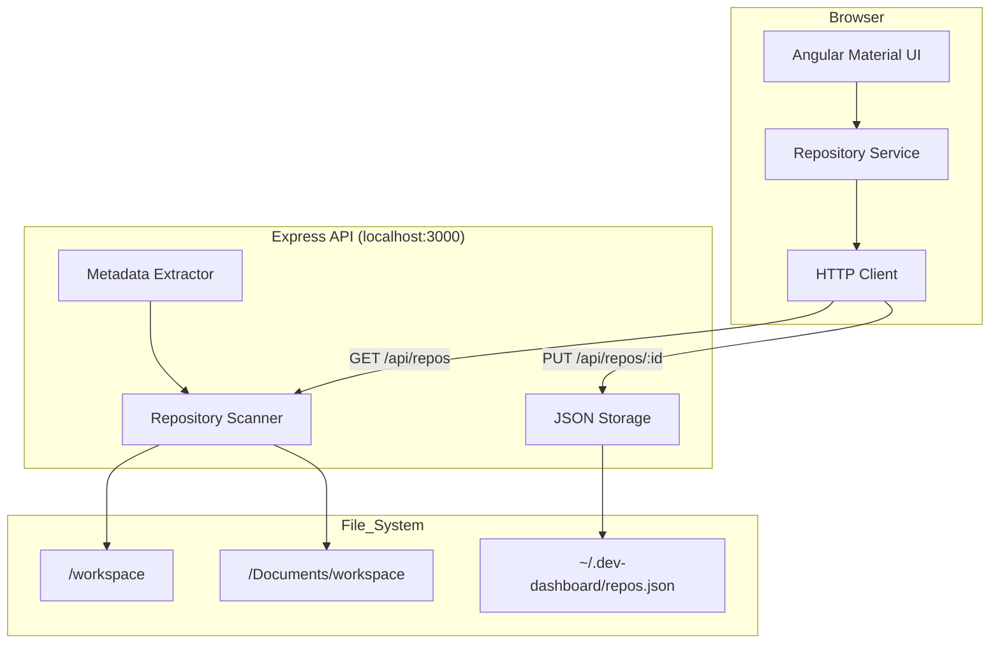
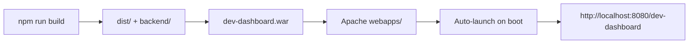

# Architecture Design

**Project:** Dev-Dashboard  
**Version:** 1.0.0  
**Date:** 2026-05-04  
**Status:** Draft

---

## 1. System Overview

Dev-Dashboard is a full-stack local application consisting of:
- **Frontend:** Angular 18+ SPA with Material Design
- **Backend:** Node.js/Express API for file system operations
- **Deployment:** WAR packaging for local Apache service

**Architecture Pattern:** Client-Server (Single Machine)

---

## 2. Technology Stack

### Frontend
- **Framework:** Angular 18+ (Standalone Components)
- **UI Library:** Angular Material 18+
- **State Management:** Services + RxJS BehaviorSubject
- **HTTP Client:** Angular HttpClient
- **Build Tool:** Angular CLI + esbuild

### Backend
- **Runtime:** Node.js 20 LTS
- **Framework:** Express.js 4.x
- **File System:** Native Node.js `fs` module
- **Persistence:** JSON file (`~/.dev-dashboard/repos.json`)

### Deployment
- **Web Server:** Apache HTTP Server (local)
- **Package Format:** WAR file (Angular dist + Express server)
- **Auto-Start:** Apache service (macOS launchd)

---

## 3. System Architecture



---

## 4. Component Architecture

### Frontend Components

```
src/
├── app/
│   ├── core/
│   │   ├── services/
│   │   │   └── repository.service.ts      # BehaviorSubject + HTTP
│   │   └── models/
│   │       └── repository.model.ts         # Interface definitions
│   ├── features/
│   │   └── dashboard/
│   │       ├── dashboard.component.ts      # Main view (standalone)
│   │       ├── repo-table.component.ts     # Material table
│   │       └── repo-card.component.ts      # Mobile card view
│   └── app.config.ts                       # Standalone app config
```

### Backend Modules

```
backend/
├── src/
│   ├── routes/
│   │   └── repositories.routes.js          # Express routes
│   ├── services/
│   │   ├── scanner.service.js              # File system scanner
│   │   ├── metadata.service.js             # README parser, tech detection
│   │   └── storage.service.js              # JSON file persistence
│   └── server.js                           # Express app entry
```

---

## 5. Data Model

### Repository Entity

```typescript
interface Repository {
  id: string;                    // UUID
  name: string;                  // Directory name
  path: string;                  // Absolute path
  description: string;           // README extract or manual
  techStack: string[];           // e.g., ["Node.js", "Angular"]
  phase: ProjectPhase;           // Enum: Planning, Development, etc.
  status: ProjectStatus;         // Enum: Active, Paused, Archived
  lastScanned: Date;             // Auto-updated on scan
  createdAt: Date;
  updatedAt: Date;
}

enum ProjectPhase {
  Planning = 'planning',
  Development = 'development',
  Testing = 'testing',
  Maintenance = 'maintenance'
}

enum ProjectStatus {
  Active = 'active',
  Paused = 'paused',
  Archived = 'archived'
}
```

---

## 6. API Design

### Endpoints

| Method | Endpoint | Description |
|--------|----------|-------------|
| GET | `/api/repos` | List all repositories |
| GET | `/api/repos/scan` | Trigger workspace scan |
| GET | `/api/repos/:id` | Get single repository |
| PUT | `/api/repos/:id` | Update repository metadata |
| DELETE | `/api/repos/:id` | Remove repository from list |

### Example Response

```json
{
  "id": "abc-123",
  "name": "dev-dashboard",
  "path": "/Users/oboukhris-palo/workspace/dev-dashboard",
  "description": "Local Angular Material SPA for managing repositories",
  "techStack": ["Node.js", "Angular", "TypeScript"],
  "phase": "development",
  "status": "active",
  "lastScanned": "2026-05-04T10:30:00Z",
  "createdAt": "2026-05-04T10:00:00Z",
  "updatedAt": "2026-05-04T10:30:00Z"
}
```

---

## 7. Key Design Decisions

### Decision 1: Node.js Backend
**Rationale:** Simpler than Java for file I/O; single npm ecosystem for frontend/backend.  
**Trade-off:** Developer has Java expertise, but Node.js is sufficient for this simple use case.

### Decision 2: Standalone Components
**Rationale:** Modern Angular best practice; simpler bootstrapping.  
**Trade-off:** None; aligns with Angular 15+ guidelines.

### Decision 3: JSON File Storage
**Rationale:** No database complexity needed; persistence via simple JSON.  
**Trade-off:** Not scalable to thousands of repos, but sufficient for typical developer (< 100 repos).

### Decision 4: WAR Packaging
**Rationale:** Requirement specifies Apache deployment.  
**Implementation:** Use `node-war` or custom script to bundle Angular dist + Express into WAR.

---

## 8. Non-Functional Considerations

### Performance
- **Scan Time:** Parallel directory traversal (Promise.all) for sub-5s scan
- **UI Rendering:** Virtual scrolling if > 50 repos (Angular CDK)

### Security
- **File Access:** Whitelist only configured workspace paths
- **No External Network:** All operations local-only

### Maintainability
- **TypeScript:** Both frontend and backend (shared types)
- **Linting:** ESLint + Prettier for consistency

---

## 9. Deployment Architecture



### Build Process
1. `ng build --prod` → Angular artifacts to `dist/`
2. Copy Express backend to `dist/backend/`
3. Package as WAR using custom script
4. Deploy to Apache `webapps/` directory

---

**Approved By:** _Pending_  
**Reviewed By:** _Pending_  
**Last Updated:** 2026-05-04
