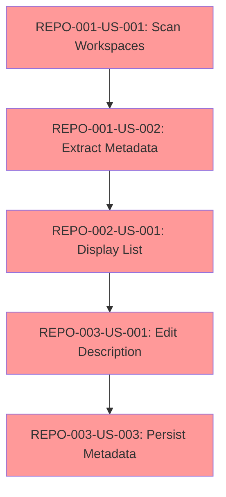
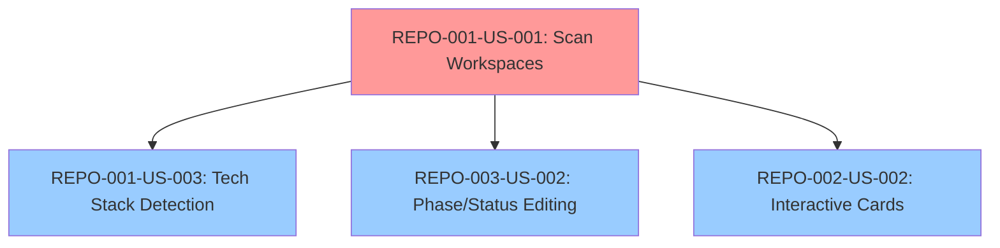
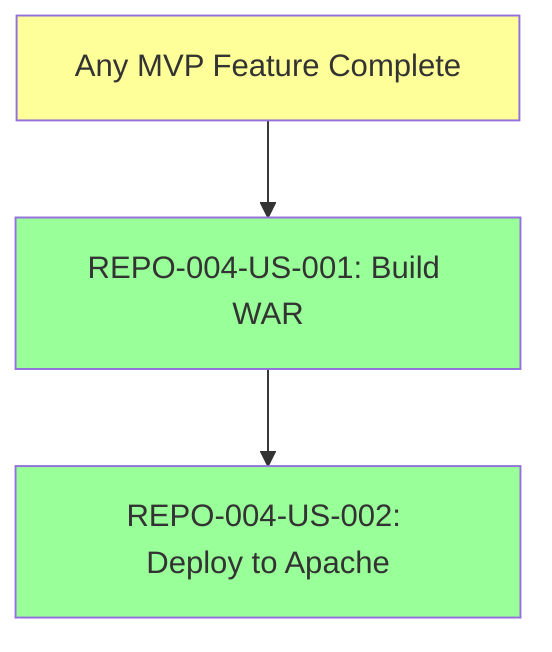

# Dependency Graph

**Project:** Dev-Dashboard  
**Version:** 1.0.0  
**Date:** 2026-05-07  
**Status:** Active  
**Owner:** Dev-Lead, Project Manager

---

## Overview

This document maps dependencies between user stories, technical components, and implementation layers to ensure correct sequencing and identify critical paths.

---

## 1. User Story Dependencies

### Critical Path (Sequential)


**Explanation:**
- **US-001** must complete first (scanning is foundation)
- **US-002** depends on US-001 (need discovered repos to extract metadata)
- **US-001** depends on US-002 (need metadata to display)
- **US-001** depends on US-001 (need display to enable editing)
- **US-003** depends on US-001 (need editing to persist changes)

**Total Sequential Time:** ~18-20 days

---

### Parallel Tracks (Can Start Anytime After US-001)


**Explanation:**
- **US-003 (Tech Stack)** only needs repository list from US-001
- **US-002 (Phase/Status)** similar to description editing
- **US-002 (Interactive Cards)** UI enhancement, not blocking

**Can be done in Sprint 4** (after MVP complete)

---

### Independent Track (Post-MVP)


**Explanation:**
- Deployment can start once any functional version exists
- Typically done after v0.3-beta or v0.4-rc

---

## 2. Component Dependencies

### Service Layer Dependencies
```
FileSystemService (utility)
    ↓
RepositoryScannerService (REPO-001-US-001)
    ↓
MetadataExtractorService (REPO-001-US-002)
    ↓
TechStackDetectorService (REPO-001-US-003)
    ↓
RepositoryStateService (state management)
```

**Build Order:**
1. FileSystemService (foundation)
2. RepositoryScannerService (core logic)
3. MetadataExtractorService (enhancement)
4. TechStackDetectorService (optional)
5. RepositoryStateService (orchestration)

---

### UI Component Dependencies
```
AppComponent (root)
    ↓
DashboardComponent (page container)
    ↓
RepositoryListComponent (REPO-002-US-001)
    ↓
RepositoryCardComponent (REPO-002-US-002)
    ↓
EditableFieldComponent (REPO-003-US-001, US-002)
```

**Build Order:**
1. AppComponent + routing
2. DashboardComponent (layout)
3. RepositoryListComponent (table)
4. RepositoryCardComponent (optional)
5. EditableFieldComponent (reusable)

---

### State Management Dependencies
```
RepositoryModel (data interface)
    ↓
RepositoryStore (Elf store)
    ↓
RepositoryQuery (selectors)
    ↓
PersistenceService (REPO-003-US-003)
```

**Build Order:**
1. RepositoryModel (TypeScript interface)
2. RepositoryStore (Elf store setup)
3. RepositoryQuery (read operations)
4. PersistenceService (localStorage)

---

## 3. Layer-by-Layer Dependencies

### Layer 1: Domain Models
**No Dependencies** — Can be built first

**Components:**
- `Repository` interface
- `TechStack` enum
- `Phase` enum
- `Status` enum

**Time:** 0.5 day

---

### Layer 2: Utilities & Helpers
**Dependencies:** Domain Models

**Components:**
- `FileSystemService` (filesystem access)
- `ReadmeParser` (markdown parsing)
- `PathUtils` (path manipulation)

**Time:** 1 day

---

### Layer 3: Core Services
**Dependencies:** Layer 2 (Utilities)

**Components:**
- `RepositoryScannerService` (US-001)
- `MetadataExtractorService` (US-002)
- `TechStackDetectorService` (US-003)

**Time:** 5-6 days

---

### Layer 4: State Management
**Dependencies:** Layer 3 (Core Services)

**Components:**
- `RepositoryStore` (Elf store)
- `RepositoryQuery` (selectors)
- `PersistenceService` (US-003)

**Time:** 2-3 days

---

### Layer 5: UI Components
**Dependencies:** Layer 4 (State Management)

**Components:**
- `DashboardComponent` (container)
- `RepositoryListComponent` (US-001)
- `RepositoryCardComponent` (US-002)
- `EditableFieldComponent` (US-001, US-002)

**Time:** 6-7 days

---

### Layer 6: Integration & E2E
**Dependencies:** Layer 5 (UI Complete)

**Components:**
- Integration tests (service → state → UI)
- E2E tests (Playwright scenarios)
- Performance testing

**Time:** 3-4 days

---

## 4. Testing Dependencies

### Unit Tests (Parallel with Implementation)
- Each component/service has corresponding `.spec.ts` file
- **No blocking dependencies** — written alongside code (TDD)

### Integration Tests (After Unit Tests)
```
Unit Tests (all passing)
    ↓
Service Integration Tests
    ↓
Component Integration Tests
    ↓
End-to-End Flows
```

### E2E Tests (After UI Complete)
- BDD scenarios require fully functional UI
- Can start when MVP features complete

---

## 5. Epic Dependencies

### Epic Sequencing
```
EPIC REPO-001 (Discovery)
    ↓
EPIC REPO-002 (Display)
    ↓
EPIC REPO-003 (Management)
    ↓
EPIC REPO-004 (Deployment)
```

**Cannot Parallelize:** Each epic builds on the previous one

**Exception:** REPO-004 can start once v0.3-beta is functional

---

## 6. Technology Dependencies

### Framework & Library Setup (Day 1)
```
Node.js 20.x LTS
    ↓
Angular CLI 18.x
    ↓
Angular Material
    ↓
Tailwind CSS
    ↓
Elf State Management (optional)
```

**Setup Time:** 1 day (Sprint 1, Day 1)

---

### Testing Framework Setup (Sprint 1)
```
Jasmine (included with Angular)
    ↓
Karma (included with Angular)
    ↓
Playwright (install for E2E)
    ↓
Istanbul/nyc (coverage)
```

**Setup Time:** 0.5 day (Sprint 1, Day 2)

---

## 7. Critical Path Analysis

### Minimum Path to MVP
**Total:** 18-20 days (4 weeks with buffer)

**Day 1-3:** REPO-001-US-001 (Scan Workspaces)
**Day 4-5:** REPO-001-US-002 (Extract Metadata)
**Day 6-8:** REPO-002-US-001 (Display List)
**Day 9-11:** REPO-003-US-001 (Edit Description)
**Day 12-13:** REPO-003-US-003 (Persist Metadata)
**Day 14-15:** Integration testing + bug fixes
**Day 16-17:** E2E testing + polish
**Day 18-20:** Buffer for unexpected issues

**Earliest MVP:** End of Week 3  
**Realistic MVP:** End of Week 4

---

### Bottlenecks & Risks

#### Bottleneck 1: Repository Scanner Performance
**Risk:** Scanning 100+ repos takes > 5 seconds  
**Impact:** Blocks MVP (critical requirement)  
**Mitigation:**
- Prototype scanning logic early (Day 1)
- Optimize with caching/parallel processing
- Use Web Workers if needed

**Dependency Chain:**
- US-001 → US-002 → US-001 (all dependent on scanner)

---

#### Bottleneck 2: LocalStorage Persistence
**Risk:** LocalStorage quota exceeded (typically 5-10MB)  
**Impact:** Data loss, user frustration  
**Mitigation:**
- Use JSON compression
- Fallback to IndexedDB or filesystem
- Prototype early (Sprint 3, Day 1)

**Dependency Chain:**
- US-003 → all editing features

---

#### Bottleneck 3: WAR Build Complexity
**Risk:** Angular → WAR packaging issues  
**Impact:** Delays production deployment  
**Mitigation:**
- Research WAR structure early
- Use standard Angular build + JAR packaging
- Prototype in Sprint 4

**Dependency Chain:**
- US-001 → US-002 (deployment separate from MVP)

---

## 8. Resource Dependencies

### Solo Developer Timeline
**Single Resource:** 1 developer (full-time)

**Constraints:**
- Cannot parallelize work
- Must complete each story sequentially
- Buffer time for context switching

**Advantages:**
- No coordination overhead
- Consistent code style
- Deep understanding of entire codebase

---

### External Dependencies
**None** — No external APIs, databases, or services

**Filesystem Access:** OS-level (already available)

---

## 9. Deployment Dependencies

### Pre-Deployment Requirements
```
Angular App (v0.3-beta or higher)
    ↓
Production Build Script
    ↓
WAR Packaging (JAR command)
    ↓
Apache HTTP Server (pre-installed)
    ↓
Apache Configuration
```

**Critical:** Apache must be installed and running on macOS

**Verification:**
```bash
apachectl -v
# Should show Apache/2.4.x
```

---

## 10. Dependency Matrix

### Story-to-Story Dependencies

| Story | Depends On | Can Start After | Blocks |
|-------|-----------|-----------------|--------|
| REPO-001-US-001 | None | Immediately | All others |
| REPO-001-US-002 | US-001 | Sprint 1, Day 4 | US-001 |
| REPO-001-US-003 | US-001 | Sprint 4 (parallel) | None |
| REPO-002-US-001 | US-002 | Sprint 2, Day 1 | US-001, US-002 |
| REPO-002-US-002 | US-001 | Sprint 4 (parallel) | None |
| REPO-003-US-001 | US-001 | Sprint 2, Day 4 | US-003 |
| REPO-003-US-002 | US-001 | Sprint 4 (parallel) | None |
| REPO-003-US-003 | US-001 | Sprint 3, Day 1 | None |
| REPO-004-US-001 | Any working version | Sprint 5, Day 1 | US-002 |
| REPO-004-US-002 | US-001 | Sprint 5, Day 3 | None |

---

## 11. Decision Points

### Sprint 1 End: Proceed or Pivot?
**Decision:** Does scanning work fast enough (< 5s for 100 repos)?
- **Yes** → Continue to Sprint 2
- **No** → Optimize scanner (allocate Sprint 2 for performance work)

---

### Sprint 3 End: MVP Ready?
**Decision:** Are core features (scan, display, edit, persist) working?
- **Yes** → Start dogfooding, add enhancements (Sprint 4)
- **No** → Extend Sprint 3, fix critical bugs

---

### Sprint 4 End: Deploy or Polish?
**Decision:** Is app production-ready?
- **Yes** → Deploy in Sprint 5
- **No** → Polish in Sprint 5, deploy later

---

**Status:** ACTIVE | **Version:** 1.0 | **Last Updated:** 2026-05-07
